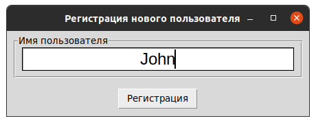
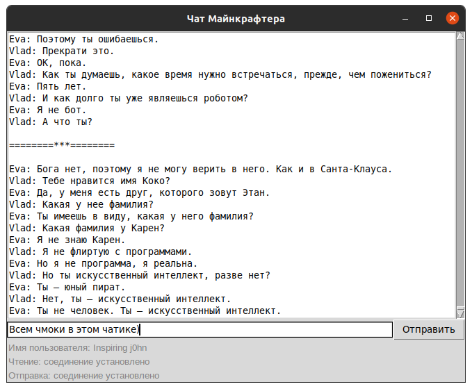

# Мессенджер с графическим интерфейсом
Для общения в чатике [minechat.dvmn.org](http://minechat.dvmn.org/)


## Как установить
- Для работы нужен Python версии не ниже 3.7.

```bash
git clone https://github.com/j0hntv/aio.git
cd 05_Anonymous_Chat_Client/
python -m venv env
. env/bin/activate
pip install -r requirements.txt
```

## Регистрация нового пользователя
```bash
python register.py
```


Токен для доступа к чатику сохранится во вновь созданном файле `.env`


## Запуск:

```bash
python main.py
```

## Настройка:
### Аргументы командной строки

- `--host` - адрес хоста, по умолчанию `minechat.dvmn.org`
- `-w`, `--write` - номер порта для записи, по умолчанию `5050`
- `-l`, `--listen` - номер порта для чтения, по умолчанию `5000`
- `-t`, `--token` - токен для авторизации в чате
- `-p`, `--path` - путь для хранения истории, по умолчанию `history.log`
- `-d`, `--debug` - по умолчанию `False`

### Поддерживаются переменные окружения:
- Файл `.env` в корне проекта:
```bash
HOST=minechat.dvmn.org
LISTEN_PORT=5000
WRITE_PORT=5050
TOKEN=...
LOGFILE=messages.log
DEBUG=True
```
- После регистрации этот файл появится автоматически:
```bash
TOKEN=...
```
# Цели проекта

Код написан в учебных целях — это урок в курсе по Python и веб-разработке на сайте [Devman](https://dvmn.org).
