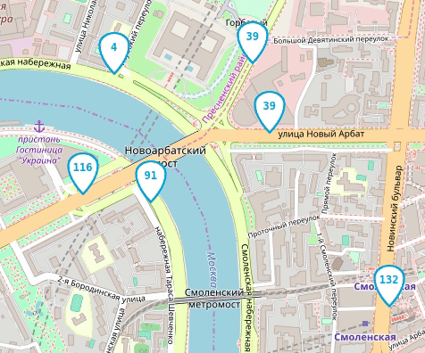

# Автобусы на карте Москвы

Веб-приложение показывает передвижение автобусов на карте Москвы.



# Как запустить

- Скачайте код
- Используйте виртуальное окружение:
```
python -m venv env
source env/bin/activate
```
- Установите зависимости:
```
pip install -r requirements.txt
```
- Запустите имитатор автобусов:
```
python fake_bus.py
```
- Запустите сервер:
```
python server.py
```
- Откройте в браузере файл index.html


# Настройки

## Сервер

`--host` - Адрес хоста, по умолчанию 127.0.0.1

`--bus-port` - Порт для имитатора автобусов, по умолчанию 8080

`--browser-port` - Порт для браузера, по умолчанию 8000

`-v` - Настройка логирования, по умолчанию True

## Имитатор автобусов

`--server` - Адрес сервера, по умолчанию ws://127.0.0.1:8080

`--routes-number` - Количество маршрутов, по умолчанию -1 (все)

`--buses-per-route` - Количество автобусов на каждом маршруте, по умолчанию 1

`--websockets-number` - Количество открытых веб-сокетов, по умолчанию 5

`--emulator-id` - Префикс к busId на случай запуска нескольких экземпляров имитатора, по умолчанию ''

`--refresh-timeout` - Задержка в обновлении координат сервера, по умолчанию 1 (секунда)

`--buffer-size` - Максимальное количество элементов, которое может быть буферизовано в канале перед блокировкой, по умолчанию 0

`--directory-path` - Путь к файлам с маршрутами, по умолчанию

`-v` - Настройка логирования, по умолчанию True

## Фронтенд

Внизу справа на странице можно включить отладочный режим логгирования и указать нестандартный адрес веб-сокета.


Настройки сохраняются в Local Storage браузера и не пропадают после обновления страницы. Чтобы сбросить настройки удалите ключи из Local Storage с помощью Chrome Dev Tools —> Вкладка Application —> Local Storage.

Если что-то работает не так, как ожидалось, то начните с включения отладочного режима логгирования.

# Формат данных

Фронтенд ожидает получить от сервера JSON сообщение со списком автобусов:

```js
{
  "msgType": "Buses",
  "buses": [
    {"busId": "c790сс", "lat": 55.7500, "lng": 37.600, "route": "120"},
    {"busId": "a134aa", "lat": 55.7494, "lng": 37.621, "route": "670к"},
  ]
}
```

Те автобусы, что не попали в список `buses` последнего сообщения от сервера будут удалены с карты.

Фронтенд отслеживает перемещение пользователя по карте и отправляет на сервер новые координаты окна:

```js
{
  "msgType": "newBounds",
  "data": {
    "east_lng": 37.65563964843751,
    "north_lat": 55.77367652953477,
    "south_lat": 55.72628839374007,
    "west_lng": 37.54440307617188,
  },
}
```

# Тесты
```
python -m pytest tests.py
```

# Используемые библиотеки для фронтенда

- [Leaflet](https://leafletjs.com/) — отрисовка карты
- [loglevel](https://www.npmjs.com/package/loglevel) для логгирования


# Цели проекта

Код написан в учебных целях — это урок в курсе по Python и веб-разработке на сайте [Devman](https://dvmn.org).
